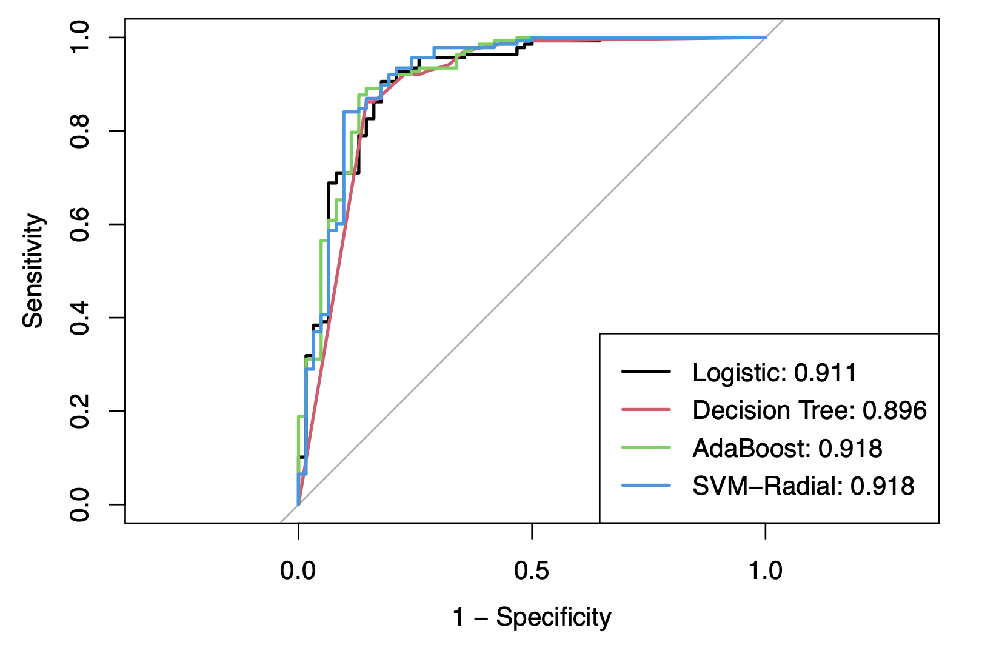
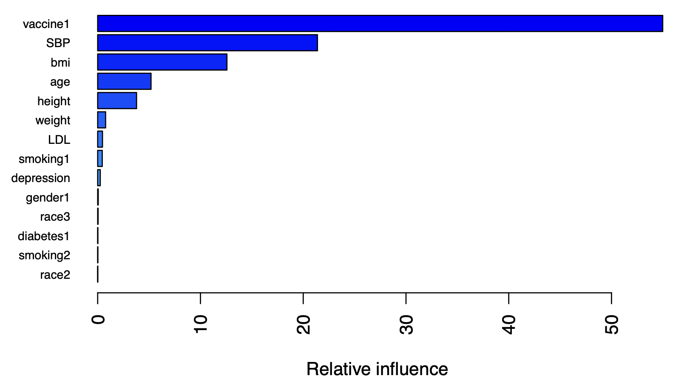
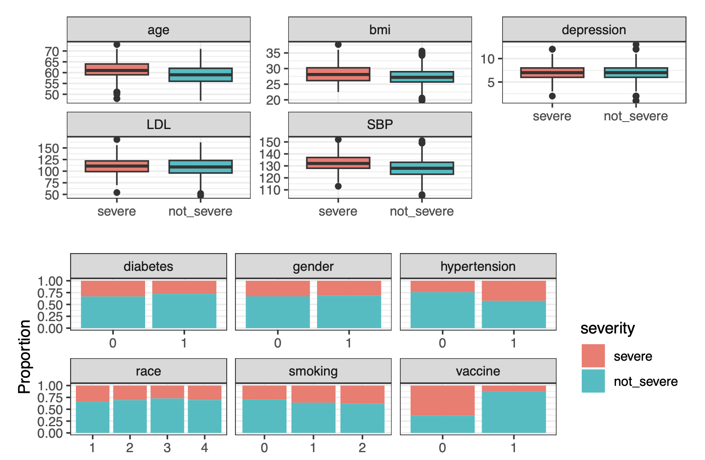
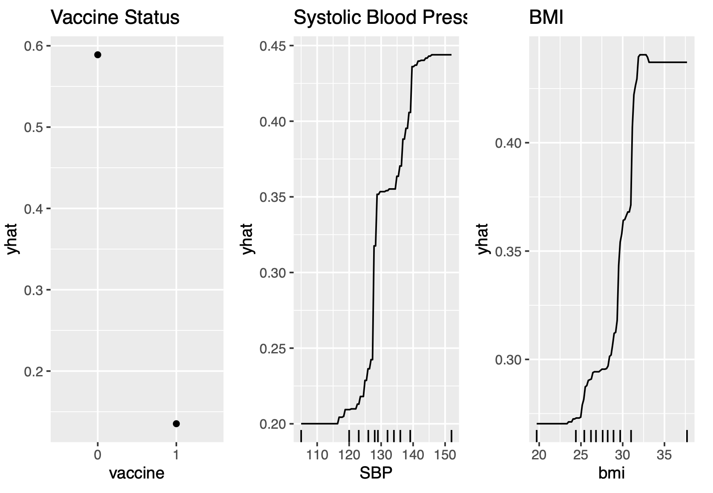

# Predicting COVID-19 Illness Severity

Which patient characteristics predict severe COVID-19 infection, and do complex machine learning models predict it better than simple ones? This project compares four classifiers on demographic and clinical data from a COVID-19 cohort, turns the best model's predicted probabilities into an individual risk score, and uses the model to explain how the top risk factors affect risk.

**Author:** Heather Lu · **Language:** R (caret, gbm, kernlab, pROC, pdp)

📄 [Full report (PDF)](report/report.pdf) · 💻 [Analysis code (R Markdown)](analysis/covid_severity.Rmd) · 📊 [Knitted analysis output (PDF)](analysis/analysis.pdf)

## Key findings

- **The complex models were only slightly better.** AdaBoost and an RBF-kernel SVM reached a test AUC of **0.918**, compared with **0.911** for logistic regression and **0.896** for a decision tree. Most of the predictive signal is captured by a simple linear model.
- **Vaccination status is the strongest predictor** (about 55% of relative influence). Unvaccinated patients had a predicted risk of about **0.59**, compared with **0.15** for vaccinated patients, roughly four times higher.
- **Blood pressure and BMI show threshold effects.** Predicted risk climbs sharply once systolic blood pressure passes about 125–140 mmHg, and once BMI rises above about 25 kg/m².
- **The risk score separates the two groups well.** Severe cases had a mean predicted risk of 0.602, compared with 0.184 for non-severe cases. All 10 highest-scoring test patients were truly severe.

<p align="center">
  
  
</p>

## Data

The sample is 1,000 participants drawn at random from a 10,000-person COVID-19 cohort (2021–2023). It was split 80/20 into a training set (n = 800) and a test set (n = 200). About 32% of the sample had severe illness.

| Type | Variables |
|---|---|
| Outcome | `severity` (severe / not severe) |
| Demographic | age, gender, race |
| Clinical | height, weight, BMI, systolic blood pressure (SBP), LDL cholesterol, depression score, smoking status, hypertension, diabetes, vaccination status |

The dataset is **not included** in this repository. See [`data/README.md`](data/README.md).



## Methods

All models were trained with `caret` using 10-fold cross-validation, with ROC AUC as the selection metric.

| Model | Tuning |
|---|---|
| Logistic regression | none (linear baseline) |
| Decision tree (`rpart`) | complexity parameter `cp`: 100 values on a log scale |
| AdaBoost (`gbm`, `distribution = "adaboost"`) | `n.trees`, `interaction.depth`, `shrinkage`, with `n.minobsinnode = 10` |
| SVM with radial kernel (`svmRadialSigma`) | cost `C` × kernel width `sigma` (30 × 15 grid) |

AdaBoost had the highest mean cross-validated AUC, so it was chosen as the final model. It was then interpreted with relative-influence variable importance and partial dependence plots.

### Cross-validated performance (10 folds)

| Model | Mean AUC | Median AUC | Sensitivity | Specificity |
|---|---|---|---|---|
| Logistic regression | 0.861 | 0.867 | 0.676 | 0.885 |
| Decision tree | 0.833 | 0.844 | 0.679 | 0.893 |
| **AdaBoost** | **0.868** | 0.861 | 0.660 | 0.915 |
| SVM-Radial | 0.859 | 0.871 | 0.734 | 0.810 |

### Partial dependence of the top three predictors



## Reproducing the analysis

1. Install R along with the packages below:
   ```r
   install.packages(c("tidyverse", "caret", "tidymodels", "pROC", "pdp", "gbm",
                      "kernlab", "gridExtra", "knitr", "rpart.plot"))
   ```
2. Put `severity.RData` in the `data/` folder.
3. Open `analysis/covid_severity.Rmd` and knit it. The random seed is fixed at `3978`, so the sample, the train/test split and the CV folds are reproducible. The SVM and AdaBoost grid searches take a few minutes.

## Repository structure

```
.
├── analysis/
│   ├── covid_severity.Rmd   # full analysis code
│   └── analysis.pdf         # knitted output
├── data/
│   └── README.md            # where to put severity.RData (not tracked)
├── figures/                 # figures used in this README
└── report/
    └── report.pdf           # written report
```
